# 🤖 RAG - Retrieval-Augmented Generation System

> 💡 **Transform your documents into an intelligent, conversational AI assistant!**

A powerful, flexible RAG (Retrieval-Augmented Generation) system that turns your markdown files, web content, and documentation into an interactive AI-powered knowledge base. Chat with your documents, search intelligently, and get accurate answers with proper source citations!

## ✨ Features

🧠 **Multi-LLM Support**

- 🦙 **Ollama** - Run powerful models locally
- 🤖 **OpenAI** - GPT-4 and other OpenAI models
- 🌟 **Google Gemini** - Google's latest AI models

📚 **Flexible Document Ingestion**

- 📄 Local markdown files
- 🌐 Web URLs with smart content extraction
- 🔄 Batch processing of multiple sources
- 🧹 **LLM-powered document cleaning** - Remove ads, navigation, and obsolete content
- 🎯 Smart chunking with overlap for better context

💬 **Interactive Chat Interface**

- 🖥️ Beautiful terminal UI powered by Textual
- 💭 Conversational memory across messages
- 📝 Markdown-formatted responses with citations
- 🎨 Tokyo Night theme for easy on the eyes
- ⚡ Real-time streaming responses

🔍 **Intelligent Search**

- 🎯 Semantic similarity search
- 📊 Configurable result count
- 🔗 Automatic footnote generation
- 🎨 Rich markdown output with syntax highlighting

🗄️ **Vector Database**

- 💾 Persistent ChromaDB storage
- 🔄 Incremental document updates
- 🧹 Collection management and cleanup
- 🎯 Multiple embedding model support

## 🚀 Quick Start

### Installation

```bash
# Install uv package manager (if not installed)
curl -LsSf https://raw.githubusercontent.com/astral-sh/uv/main/install.sh | sh

# Clone the repository
git clone <repository-url>
cd rag

# Install dependencies (requires Python 3.12+)
uv venv
source .venv/bin/activate  # or .venv/Scripts/activate on Windows
uv sync
```

### Basic Usage

1️⃣ **Fill your knowledge base:**

```bash
# Add local markdown files
python main.py data-fill examples/markdown.md

# Add web content
python main.py data-fill https://example.com/docs --source-type url

# Add web content with cleaning (removes ads, navigation, etc.)
python main.py data-fill https://example.com/docs --source-type url --clean-content

# Configure chunk size and overlap for better context
python main.py data-fill docs/*.md --chunk-size 800 --chunk-overlap 200

# Extract wisdom using Fabric AI
python main.py data-fill docs/*.md --extract-wisdom

# Upload processed markdown to S3
python main.py data-fill docs/*.md --bucket-name my-docs --bucket-path rag/
```

2️⃣ **Search your documents:**

```bash
python main.py search "How do I learn Rust effectively?"
```

3️⃣ **Start an interactive chat:**

```bash
python main.py chat
```

## 🎮 Commands

### 📥 Data Fill

Ingest documents into your vector database:

```bash
python main.py data-fill [OPTIONS] SOURCE_PATH [SOURCE_PATH...]

Options:
  --source-type [file|url]     Type of source data (default: file)
  --mode [single|elements]     Processing mode (default: single)
  --cleanup                    Clean collection before filling
  --collection NAME            Collection name (default: RAG)
  --embedding-model MODEL      Embedding model (default: nomic-embed-text)
  --embedding-llm [openai|ollama|gemini] Embedding LLM provider (default: ollama)
  --llm [openai|ollama|gemini] LLM provider (default: ollama)
  --chromadb-host HOST        ChromaDB server host (default: 127.0.0.1)
  --chromadb-port PORT        ChromaDB server port (default: 8000)
  --ollama-host HOST          Ollama server host (default: 127.0.0.1)
  --ollama-port PORT          Ollama server port (default: 11434)

Document Processing Options:
  --clean-content             Clean document content by removing ads, navigation, etc.
  --extract-wisdom            Extract wisdom using Fabric AI
  --fabric-command CMD        Fabric command name (default: fabric)
  --chunk-size SIZE          Size of text chunks (default: 600)
  --chunk-overlap SIZE       Overlap between chunks (default: 200)

S3 Storage Options:
  --bucket-name NAME          S3 bucket name for markdown storage
  --bucket-path PATH         S3 bucket path prefix
```

### 🔍 Search

Query your knowledge base:

```bash
python main.py search [OPTIONS] "your query here"

Options:
  --model MODEL                Model for generation (default: qwen3:8b)
  --dry-run                    Show system prompt without querying LLM
  --collection NAME            Collection to search (default: RAG)
  --embedding-model MODEL      Embedding model (default: nomic-embed-text)
  --embedding-llm [openai|ollama|gemini] Embedding LLM provider (default: ollama)
  --llm [openai|ollama|gemini] LLM provider (default: ollama)
```

### 💬 Chat

Interactive conversation interface:

```bash
python main.py chat [OPTIONS]

Options:
  --model MODEL                Model for generation (default: qwen3:8b)
  --collection NAME            Collection to chat with (default: RAG)
  --embedding-model MODEL      Embedding model (default: nomic-embed-text)
  --embedding-llm [openai|ollama|gemini] Embedding LLM provider (default: ollama)
  --llm [openai|ollama|gemini] LLM provider (default: ollama)

# Chat shortcuts:
# Ctrl+Enter - Send message
# Ctrl+C - Exit chat
# /clear - Clear chat history
# /info - Show current settings
```

## 🔧 Configuration

Configure via environment variables:

```bash
# Core settings
export RAG_COLLECTION="my-docs"
export RAG_DB_PATH="./vectordb"
export RAG_LOG_LEVEL="INFO"

# ChromaDB Server settings (for HTTP client)
export RAG_CHROMADB_HOST="127.0.0.1"
export RAG_CHROMADB_PORT="8000"

# LLM Configuration
export RAG_LLM="ollama"
export RAG_MODEL="qwen3:8b"
export RAG_OLLAMA_HOST="127.0.0.1"
export RAG_OLLAMA_PORT="11434"

# Embedding settings
export RAG_EMBEDDING_LLM="ollama"
export RAG_EMBEDDING_MODEL="nomic-embed-text"
export RAG_EMBEDDING_OLLAMA_HOST="127.0.0.1"
export RAG_EMBEDDING_OLLAMA_PORT="11434"

# Document Processing settings
export RAG_CLEAN_CONTENT="true"
export RAG_EXTRACT_WISDOM="false"
export RAG_FABRIC_COMMAND="fabric"
export RAG_CHUNK_SIZE="600"
export RAG_CHUNK_OVERLAP="200"

# S3 Storage settings
export RAG_BUCKET_NAME="my-docs"
export RAG_BUCKET_PATH="rag/"

# API Keys (if using cloud providers)
export OPENAI_API_KEY="your-key-here"
export GEMINI_API_KEY="your-key-here"
```

## 🏗️ Architecture

```mermaid
flowchart TD
    A[📄 Documents<br/>• Markdown<br/>• Web Content<br/>• Local Files] --> B[🧹 Document Cleaning<br/>• Remove ads<br/>• Remove navigation<br/>• Keep core content<br/>• LLM-powered]
    B --> C[⚙️ Processing<br/>• Chunking<br/>• Embedding<br/>• Metadata]
    C --> D[🗄️ Vector Store<br/>ChromaDB]

    E[🔍 User Query] --> F[🎯 Retrieval<br/>• Similarity Search<br/>• Context Gathering<br/>• Metadata Matching]
    D --> F
    F --> G[🤖 LLM<br/>• OpenAI<br/>• Ollama<br/>• Gemini]
    G --> H[📝 Response<br/>• Formatted<br/>• Citations<br/>• Markdown]

    style A fill:#e1f5fe
    style B fill:#fff8e1
    style D fill:#f3e5f5
    style G fill:#fff3e0
    style H fill:#e8f5e8
```



## 📖 Examples

### Processing Different Content Types

```bash
# Single markdown file with smart chunking
python main.py data-fill docs/guide.md --mode elements

# Web documentation with cleaning
python main.py data-fill https://docs.example.com --source-type url --enable-cleaning

# Multiple files with collection reset
python main.py data-fill *.md docs/*.md --cleanup --collection "project-docs"


```

### Advanced Search Queries

```bash
# Technical questions with dry-run to see context
python main.py search "explain dependency injection patterns" --dry-run

# Using different models
python main.py search "performance optimization tips" --model "gpt-4o" --llm openai

# Search specific collections
python main.py search "API endpoints" --collection "api-docs"
```

## 🙏 Kudos & Dependencies

This project stands on the shoulders of giants! Massive thanks to these incredible open-source projects:

### 🔋 **Core Infrastructure**

- **[ChromaDB](https://www.trychroma.com/)** - The AI-native open-source vector database that makes this all possible
- **[LangChain](https://github.com/langchain-ai/langchain)** - For document loading, text splitting, and processing magic
- **[Textual](https://github.com/Textualize/textual)** - The amazing Python framework powering our beautiful chat interface
- **[FastAPI](https://fastapi.tiangolo.com/)** - High-performance async web framework for ChromaDB server

### 🤖 **AI & ML**

- **[OpenAI](https://openai.com/)** - For GPT models and embeddings
- **[Ollama](https://ollama.ai/)** - Making local LLM deployment effortless
- **[Google AI](https://ai.google/)** - For Gemini models and embeddings
- **[Nomic](https://nomic.ai/)** - High-quality open source embeddings
- **[Fabric AI](https://docs.fabric.ai/)** - AI-powered wisdom extraction and knowledge mining

### 🛠️ **Document Processing**

- **[Unstructured](https://github.com/Unstructured-IO/unstructured)** - Fantastic document parsing and structure extraction
- **[Markdownify](https://github.com/matthewwithanm/python-markdownify)** - Clean HTML to Markdown conversion
- **[Trafilatura](https://trafilatura.readthedocs.io/)** - Advanced web content extraction
- **[NLTK](https://www.nltk.org/)** - Natural language processing toolkit
- **[Beautiful Soup](https://www.crummy.com/software/BeautifulSoup/)** - HTML parsing and cleaning
- **[boto3](https://boto3.amazonaws.com/v1/documentation/api/latest/index.html)** - AWS SDK for S3 integration

### 🎨 **User Experience**

- **[Rich](https://github.com/Textualize/rich)** - Beautiful, colorful terminal output
- **[Python-dotenv](https://github.com/theskumar/python-dotenv)** - Environment variable management
- **[colorlog](https://github.com/borntyping/python-colorlog)** - Colored log output formatting
- **[httpx](https://www.python-httpx.org/)** - Modern HTTP client for API interactions

## 🤝 Contributing

We welcome contributions! Whether it's:

- 🐛 Bug fixes
- ✨ New features
- 📚 Documentation improvements
- 🎨 UI/UX enhancements

## 📄 License

This project is open source and available under the [MIT License](LICENSE).

## 🌟 Star History

If you find this project helpful, please consider giving it a star! ⭐

---

_Built with ❤️ for the AI and open-source community_
